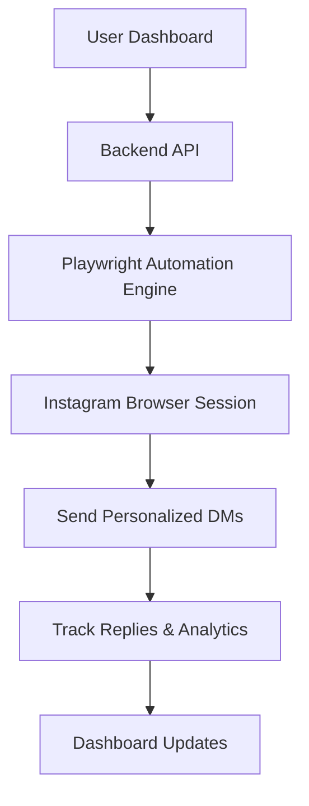

# InstaFlow – Instagram Outreach Automation Platform

<div align="center">

### AI-Powered Instagram Outreach & DM Automation Platform

Built with **Playwright**, **Node.js**, and a **Monorepo Architecture** to automate personalized Instagram outreach at scale.

</div>

---

## 🚀 Overview

InstaFlow is a full-stack Instagram outreach automation platform designed for creators, agencies, founders, and coaches who want to automate personalized Instagram DMs while maintaining a human-like workflow.

The platform uses browser automation powered by Playwright to handle Instagram interactions safely and efficiently while supporting multi-account workflows, analytics, campaign history, and AI-assisted personalization.

The platform has already been tested with and provided access to **100+ users**.

---

## ✨ Features

- 🔥 Multi-account Instagram automation
- 🤖 AI-personalized outreach messages
- 🧠 Custom messaging tone & prompts
- 📊 Analytics dashboard
- 📈 Success tracking & reply metrics
- 🕒 Randomized delay system
- 📂 Campaign history tracking
- ⚡ High-speed Playwright automation
- 🏗️ Monorepo architecture
- 🔐 Authentication & user management
- 💳 Subscription & usage plans
- 📥 Bulk username targeting
- ☁️ Scalable backend infrastructure

---

## 🛠️ Tech Stack

### Frontend
- Next.js
- React
- Tailwind CSS
- TypeScript

### Backend
- Node.js
- Express
- Playwright
- REST APIs

### Database & Infrastructure
- PostgreSQL
- Docker
- VPS Deployment
- Monorepo Setup

### Automation
- Playwright browser automation
- Human-like randomized delays
- Session handling
- Multi-account orchestration

---

## 🏗️ Monorepo Structure

```bash
instaflow/
│
├── apps/
│   ├── web/             # Frontend dashboard
│   ├── server/          # Backend APIs
│   └── automation/      # Playwright automation engine
│
├── packages/
│   ├── ui/
│   ├── config/
│   └── shared/
│
└── docker/
```

---

## ⚙️ Core Functionalities

### 🔹 Account Management
- Connect multiple Instagram accounts
- Session persistence
- Re-login handling
- Account status monitoring

### 🔹 Outreach Automation
- Automated DM sending
- Username-based targeting
- AI-generated personalized messages
- Delay randomization to simulate human behavior

### 🔹 Dashboard & Analytics
- Messages sent
- Success rate
- Failed deliveries
- Seen vs replied tracking
- Historical campaign logs

### 🔹 Subscription System
- Free / Pro / Max plans
- Daily message limits
- Feature gating
- Usage monitoring

---

# 📸 Screenshots

## Dashboard


---

## Accounts Page


---

## Automation Panel


---

## Activity History


---

## Pricing & Plans


---

# 🧠 How It Works



---

# 🚀 Installation

## Clone Repository

```bash
git clone https://github.com/yourusername/instaflow.git
cd instaflow
```

---

## Install Dependencies

```bash
npm install
```

---

## Setup Environment Variables

```env
DATABASE_URL=
JWT_SECRET=
OPENAI_API_KEY=
```

---

## Run Development Server

```bash
npm run dev
```

---

# 📊 Current Scale

- ✅ 100+ users given platform access
- ✅ Multi-account automation tested
- ✅ AI-personalized outreach working
- ✅ Stable Playwright automation flows

---

# 🔐 Important Note

This project is intended for educational and automation workflow purposes. Users should comply with Instagram's terms of service while using automation tools.

---

# 👨‍💻 Author

### Suryansh Singh

- Full Stack Developer
- Automation Engineer
- Founder of TheNerdishMic

---

# ⭐ Future Improvements

- Proxy rotation support
- AI lead scoring
- CRM integration
- Campaign templates
- Smart reply automation
- Team collaboration support
- Inbox management system

---
